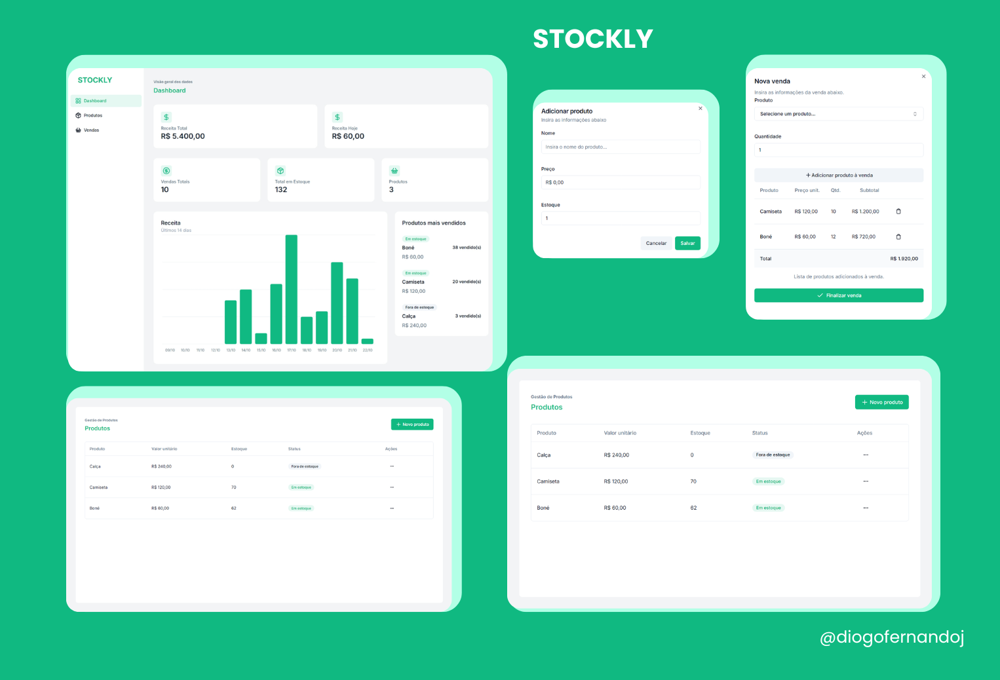

<h1 align="center">Stockly</h1>

<h1 align="center">
    <a href="https://dj-stockly.vercel.app" target="blank">
        
        <small align="center">Clique para visitar o projeto🔗</small>
    </a>
</h1>

<h2>Descrição</h2>

Stockly é um sistema de gerenciamento de estoque desenvolvido para facilitar o controle de produtos, vendas e relatórios em pequenas e médias lojas. Com ele, é possível cadastrar novos produtos, atualizar o estoque em tempo real, registrar vendas e visualizar relatórios detalhados de desempenho. O projeto foi criado com foco em resolver problemas reais de gestão, trazendo uma interface simples e eficiente.

## Tecnologias Utilizadas

- Next.js: Framework React para renderização do lado do servidor e geração de sites estáticos.

- React: Biblioteca JavaScript para criar interfaces de usuário com componentes reutilizáveis.

- TypeScript: Superset de JavaScript que adiciona tipagem estática, melhorando a segurança do código.

- Tailwind CSS: Framework de CSS utilitário para estilização rápida e responsiva.

- Shadcn UI: Biblioteca de componentes de UI com design moderno e acessibilidade.

- PostgreSQL: Sistema de gerenciamento de banco de dados relacional avançado e de código aberto.

- Prisma: ORM para Node.js e TypeScript que simplifica a interação com bancos de dados.

- React Hook Form e Zod: Validação de formulários com facilidade e maior segurança.

- Recharts: Visualização de dados em gráficos.

## Funcionalidades

- Cadastro de produtos

- Lançamento de vendas

- Atualização de estoque

- Visualização de relatórios
